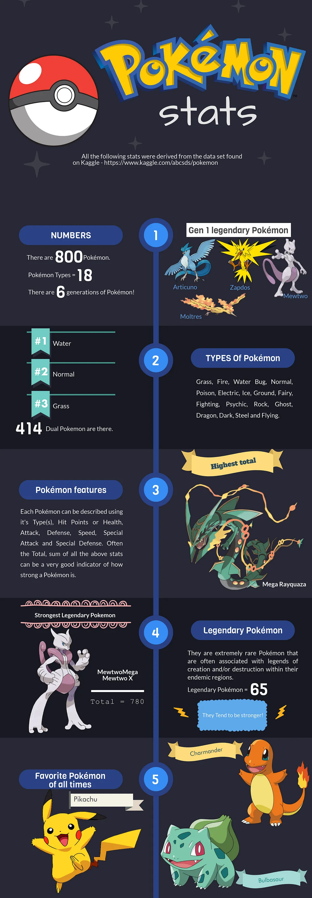

For this project, I conducted an in-depth Exploratory Data Analysis (EDA) using the Pokémon stats dataset from Kaggle. Leveraging Pandas for data manipulation and Plotly for interactive visualizations, I uncovered key patterns and insights about Pokémon attributes, such as types, stats, and distributions. The project aimed to provide a better understanding of the dataset through clear, visual representations of the data’s underlying trends.

### Write-up
I’ve shared my process and findings in a detailed Medium article, where I walk through the steps of my analysis.
[Article link](https://medium.com/@csrividhya94/exploratory-data-analysis-with-pokémon-d195da7e0382) 

### Source code
<a href="https://github.com/csrividhya/pokemon-stats"><i class="large github icon "></i>csrividhya/pokemon-stats</a>

### Dataset
[Kaggle](https://www.kaggle.com/datasets/abcsds/pokemon)

### Infographic from the analysis

